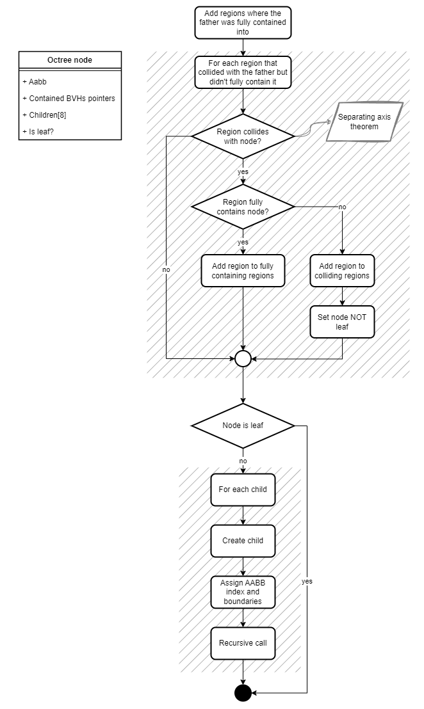
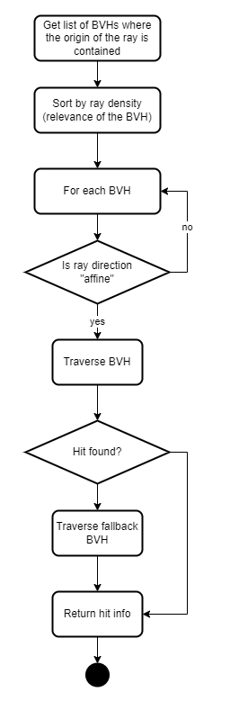

# Octree
## Construction

## Traversal

- It is possible to set a maximum depth level

# Splitting plane facing
- Each plane is given a score based on how much the ray direction of the influence area is facing this direction
- During the splitting plane phase of the BVH construction algorithm, we try the best plane, but if the results are not satisfactory, we try the second best plane, and then the third
- However, if the score of a plane is too low, and the previous split results are not satisfactory, we fallback onto choosing the longest plane and SAH.
- The parameters controlling what is satisfactory and what is an horrible plane are customizable, in order to adjust between speed and quality.

# Data collection
- 2 types of data collection:

## Construction
- It is possible to specify a pair of functions that are respectively run on each node (and can store "global" data) of a BVH and at the end of the BVH traversal (traversal for the analysis)
- At the moment we collect tons of data, most of which are for the Unity visualizer, the most important are:
  - Max level
  - Number of leaves/nodes
  - PAH/SAH cost
  - The influence area
  - Global fine-grained construction timings (if activated at compile time)
  - Per-node fine-grained construction timings (if activated at compile time)

## Traversal
- It is possible to specify a scene:
  - Triangles
  - Influence areas
  - Ray casters
- Then it is possible to cast the rays from the ray casters and collect intersection results
- Again, we collect tons of data (each one is calculated total, per ray and per BVH):
  - Real PAH-style cost
  - Real PAH-style cost for each BVH of the top level structure
  - Intersections total/with leaves/internal nodes/only when the ray hit a triangle
  - The same info but only for the traversal of non-fallback BVHs
  - Percentage of hits/misses
- It also collects the same data on a SAH BVH, in order to compare the results with the ones of our top level structure
- It is possible to specify some metrics to export to a CSV file for further analysis on Excel

# First results
## Traversal
- At the moment I tested on 7 different scenes:
  - Random sparse triangles
  - Random dense triangles
  - Wood and house
  - Cottage
  - Cottage with background
  - Crowd with background
  - Suzanne the Blender monkey
- These scenes are quite different among them, but none of them has an excessively high poly count
- For each scene we tried 4 different influence areas:
  - Perpendicular to one axis
  - 15 degrees to one axis
  - 45 degrees to 2 axes
  - Oblique (not related to any particular axis)
- We tried to experiment a bit with different BVH and Octree construction parameters, but more tests must be done. It is difficult to understand what to modify.
- The results can be seen in the Excel file:
  - In almost all cases PAH is a better estimate then SAH
  - PAH is a better estimate when there is a clear splitting plane to use (therefore it is worse in the oblique case, but still better than SAH)
  - BVHs built with PAH are better than BVHs built with SAH in all the cases, but they are generally better in the perpendicular (parallel) case
  - BUT, since, when a ray misses during the traversal of the PAH BVH we must fallback to the SAH BVH, it is worth it to use a PAH BVH only if the majority of rays that are "affine" to that BVH hit a triangle. In particular the hit percentage must be:
    $$\#rays \cdot PAH_{avg \space cost} + \#rays \cdot (1-hit\%) \cdot SAH_{avg \space cost} < \#rays \cdot SAH_{avg \space cost}$$
    $$hit\% > \frac{PAH_{avg \space cost}}{SAH_{avge \space cost}}$$
- A better estimate can be calculated if we know the fallback SAH cost (i.e. the SAH cost only of the rays that miss on the PAH BVH):
    $$\#rays \cdot PAH_{avg \space cost} + \#rays \cdot (1-hit\%) \cdot FallbackSAH_{avg \space cost} < \#rays \cdot SAH_{avg \space cost}$$
    $$hit\% > \frac{PAH_{avg \space cost}+FallbackSAH_{avg \space cost}+SAH_{avg \space cost}}{FallbackSAH_{avge \space cost}}$$
- Morevoer, in addition to these considerations, we also must take into account the time to find the PAH BVH to traverse, given a ray (or maybe there isn't and we directly use the SAH fallback)

## Construction
- For what concerns the construction, I used both benchmarking and algorithm analysis, but both have their problems:
- With benchmarking we are evaluating results on my hardware only
- Algorithm analysis can theoretically be more sound, but, again, it is not possible to assign a universal cost to the instructions, because it varies by the hardware.
- By the way it is no secret that PAH cost computation is slower than SAH. The first analysis shows that it is 5.9x slower on average (4.31ms vs 0.77ms for BVH)
- On the other hand plane facing splitting is basically the same as longest plane splitting (2.3ms for BVH)

## Other ideas
- Grid based top level
- BSP top level (I don't know if it is worth it since we already have the octree, and BSP is more suited to find the closes neighbor, and most likely slower to build)
- I can try to improve plane facing split method for point influence areas, is it worth to try it, or would it be almost irrelevant?

## Questions
- Is this enough from a quantity/quality?
- Can I make a small chapter/appendix about the C++ code itself? I tried to write clean code and I think it can be an easy to use and customizable tool.
- Do I need to try and optimize the algorithms better from a "hardware" point of view (e.g. cache utilization, parallelization)?
- Related to the $hit\%$ formula: Maybe we can try to plug in average PAH and SAH values for each scene?
- I tried to compare my SAH results to the ones of other papers, but they seem to just use benchmarking (i.e. seconds per ray metric)
- ==I find it difficult to analyze data: I don't know the right methodologies, and all in all I'm afraid to make considerations that are not mathematically sound/too empirical== (e.g. I noticed that PAH works better if there is a clear splitting direction, but I don't know how to formalize it)
- I'm using a pretty base version of SAH, modern BVH builders use more sophisticated techniques (e.g. primitives splitting, ordering to improve cache usage, stochastic sampling ...)
- Can I start writing?